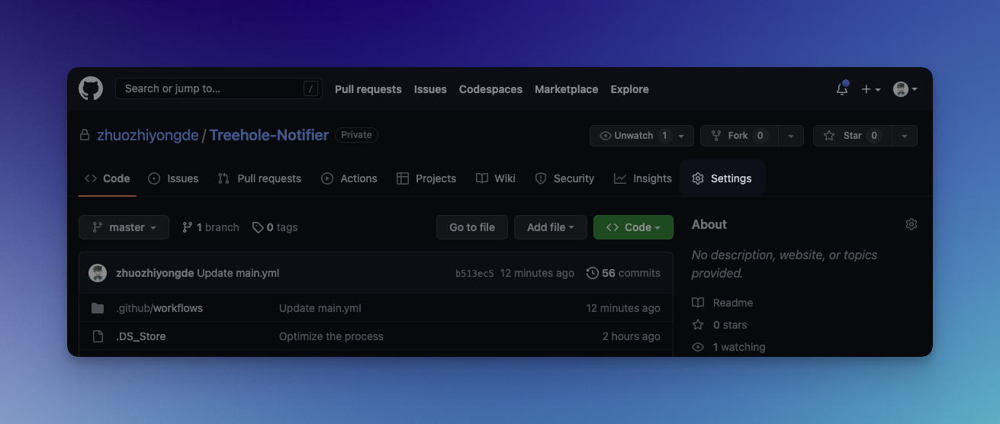
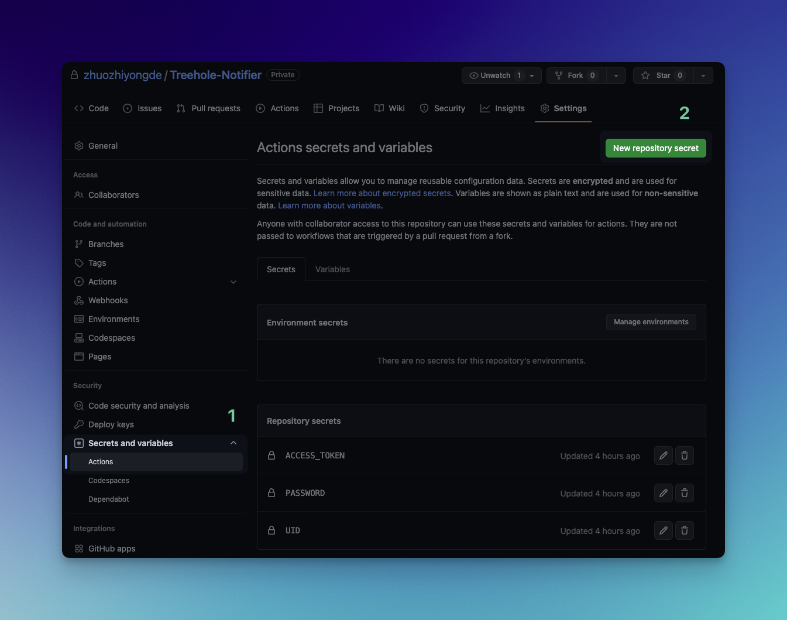
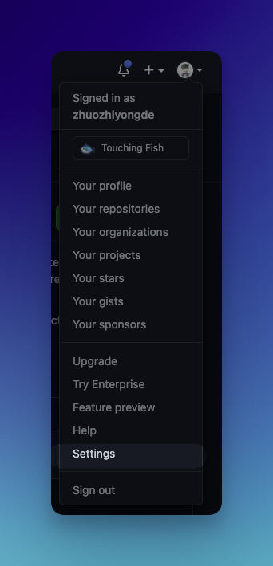
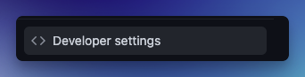
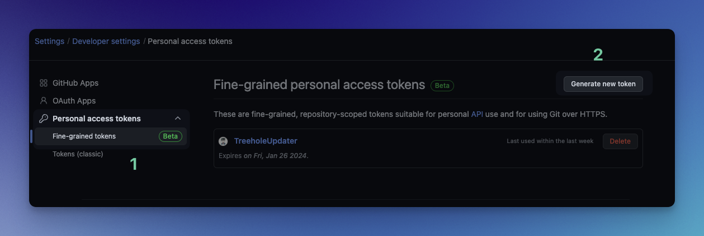
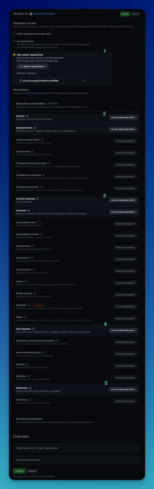
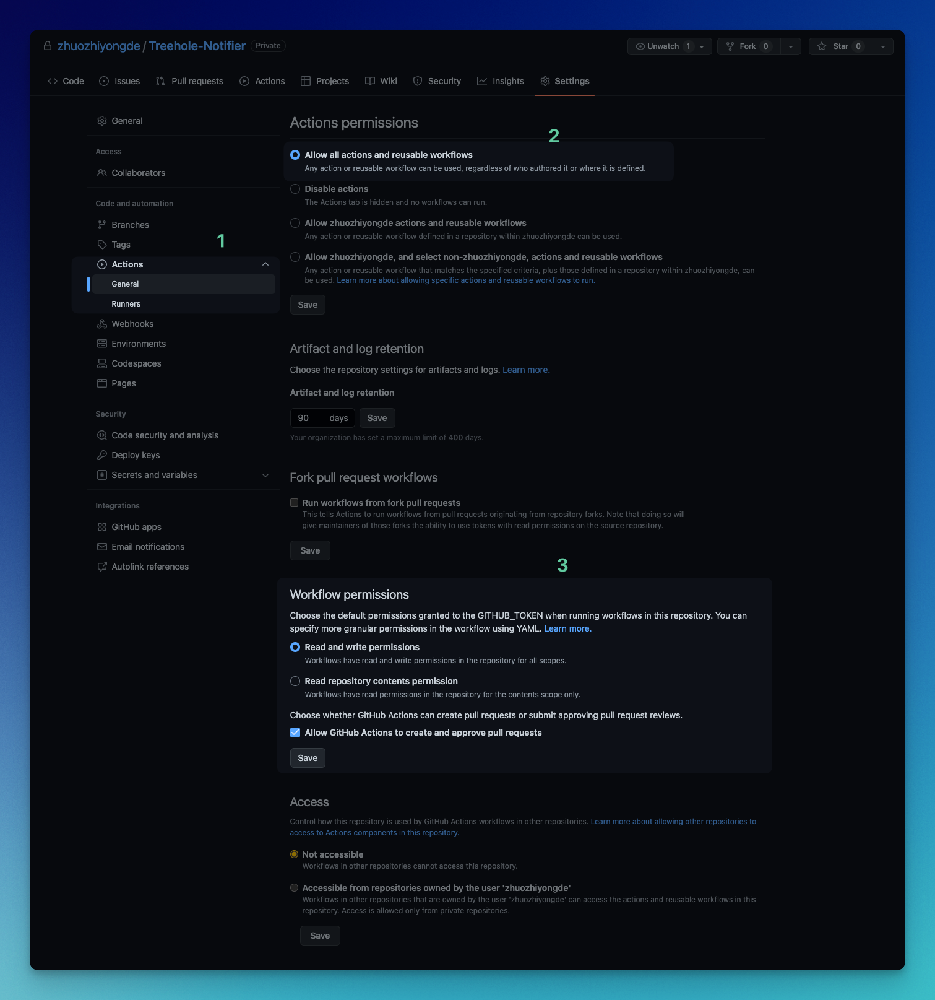
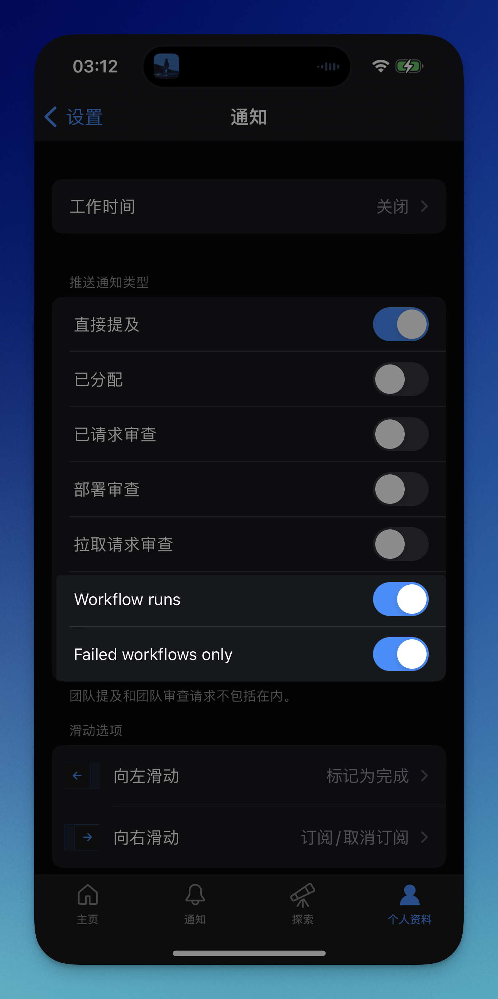

# Treehole Notifier

Inspired by my INSANE ICS REFRESHER friend.

## Process

1. 运行 `TreeholeSpider.py` 以爬取树洞。
2. 检运行查结果和已有结果的差异。
3. 将更新结果存储到 JSON 文件中。
4. 通过 Github Actions 来定时执行上述流程
5. 结果有更新时（此时自动触发了 git push），通过 Github Mobile 发送通知。

## Usage

### 配置 JSON 文件

请参考 `*_example.json` 文件对对应的 `json` 文件进行配置，以下对参数做说明：

**watch_list.json**

```js
// watch_list_example.json
{
    "watch_list": [ // 监测树洞列表
        {
            "tid": 1948761, // 监测树洞的id
            "nick": "advanced_math", // 监测树洞的自定义昵称，可选
            "last_update": 0 // 记录该树洞所有回复中的最新时间戳
        }
    ]
}
```


**watch_keywords.json**

```js
// watch_keywords_sample.json
{
    "watch_keywords": [ // 监测关键词列表
        { // 每个对象即为一个监测
            "keyword": "ICS", // 监测关键词
            "ignore_pattern": false, // 是否使用正则表达式过滤输出结果，可选
            "last_hole": 4642133 // 记录的该关键词最后更新的树洞
        }
    ]
}
```

说明：我内置实现了对于关键词的重新过滤，即对关键词搜搜结果进行了又一次的查找以解决并集问题。


### 配置 Github Actions Schedule Cron

如果你想要自定义检查更新时间，请参照 [官方指引](https://docs.github.com/en/actions/using-workflows/workflow-syntax-for-github-actions#onschedule)，调整你的 `./github/workflows/main.yml` 第 4 行。

默认配置为每小时的第 30 分钟进行一次检查。也即每天会总共进行 24 次检查。


### 配置账号、密码、Github Access Token

由于后端验证更新，目前采用账号+密码的形式登录获取 `token`

你需要按照如下路径配置所必需的参数：

**配置账号密码**

1. 点击项目上方 `Settings`

   

2. 点击侧栏 `Secrets and varibles` > `Actions` > `New repository secret`

   

3. 依次配置 `UID`、`PASSWORD`

   `UID`：账号（学号）

   `PASSWORD`：密码


**配置 Github Access Token**

Github Access Token 是为了使用 git 来更新监视状态（也即 `watch_list.json` 和 `watch_keywords_list.json` ）

1. 点击页面右上角 `个人头像` > `Settings`

   

2. 点击侧栏最下方 `Devloper settings`

   

3. 点击侧栏 `Personal access token` > `Fine-grained tokens` > 页面右上 `Generate new token`

   

4. 验证 `Confirm access`

5. 配置如下权限

   **注意：我不保证这是所需要权限的最小集，因为我也没太搞懂这些权限之间的区别，但我确定按照这样配置是可用的。设置失效时间建议直接设置三年（最大值）**

   

6. 复制你的 `ACCESS_TOKEN`，并参照先前的步骤存入你的 `Repo secrets` ，注意名称一定要保持为 `ACCESS_TOKEN`

**调整 Action General**

按照如下步骤调整：

1. 点击项目上面 `Settings`

2. 点击侧边栏 `Actions` > `General`，在右侧面板配置如下：

   


### 配置你的通知策略

在你的 Github Mobile 中，选择 `个人资料` > `设置` > `通知`，同时打开 `Workflow runs ` 与 `Failed workflows only`。

**注意：只有在打开 `Failed workflows only` 下，才会仅对更新进行通知，否则每次定时爬取都会触发通知！**




## Effect

每当检测到树洞/关键词更新时，你会获得一条如下的推送消息：


## Remind

本项目的实现流程相当简陋，为个人首次学习 Github Actions 配置，实现的想法也完全来源于突发奇想，目前的效果也算不上多么完美，只是会在检测到更新之后给你的 iPhone/iPad 发送一条 `Run failed` 推送而已。

为了能够公开使用，我没有采取个人服务器来完成检测更新的操作，也因为能力有限，没有采用其他的 iOS 推送方法，如果你想自定义更加完善的控制流程，欢迎自行实现。

**谨慎使用。我对本项目导致的任何后果不负任何责任。**

   
